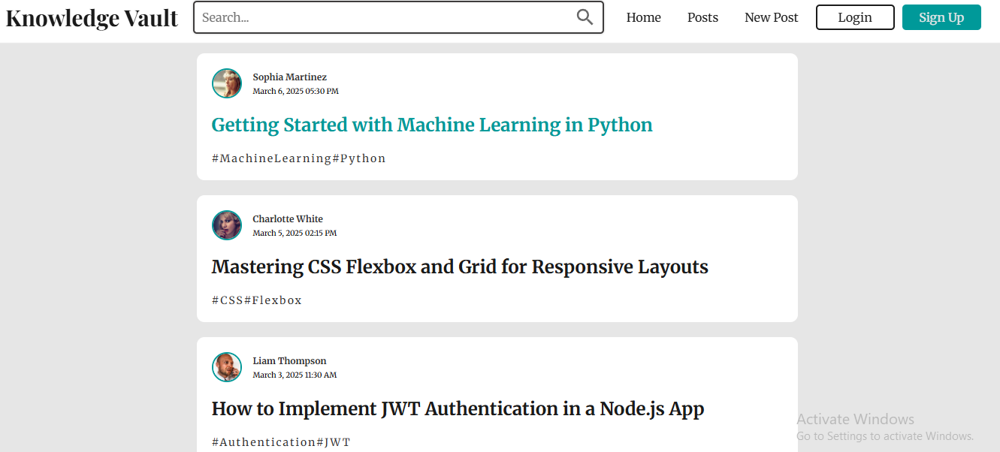
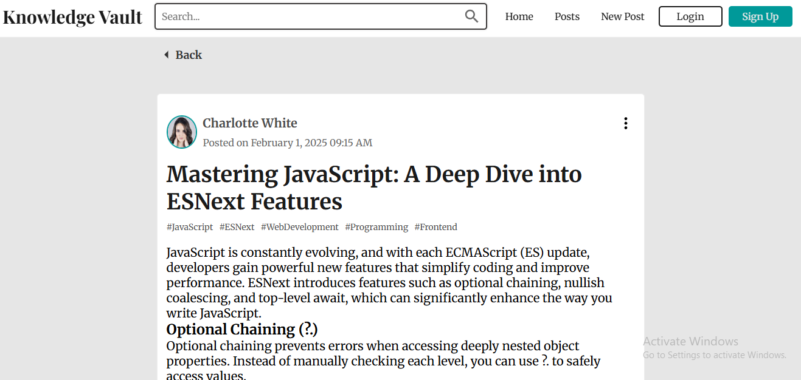
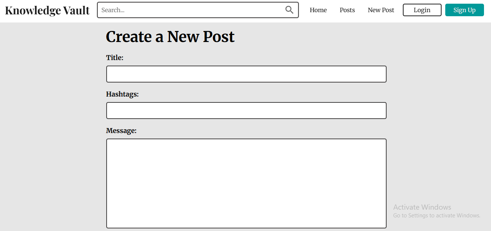

## 🚀 Knowledge Vault

A modern, user-friendly blogging platform built with React that allows users to create, edit, search, and interact with posts. It supports Markdown formatting, code highlighting, and a seamless navigation experience.

## 🚀 Live Demo

👉 **[View Live Project](https://the-knowledge-vault.netlify.app/)**

## 🏆 Features

✅ 📝 Create & Edit Posts – Write and format posts using Markdown for rich-text support.

✅ 🔍 Search & Filter – Find relevant posts quickly with an intuitive search system.

✅ 🎨 Syntax Highlighting – Supports code blocks with Prism.js + React Markdown.

✅ 📂 Fully Responsive UI – Optimized for mobile and desktop.

✅ 💬 User Interactions – Users can like,1 comment, bookmark, and star posts.

✅ 🚀 Fast Navigation – Integrated React Router for smooth page transitions.

✅ ⚡ Optimized Performance – Uses lazy loading, efficient state management, and local caching.

✅ 🛑 404 Page Handling – Custom error page for broken or invalid links.

## 🖼️ Screenshots

## 🏠 Home Page

## 📝 Post Page

## 📄 New Post Page

## 🛠 Tech Stack

Technology

React.js

React Router

React Markdown

Prism.js

Axios

CSS Modules

Date-fns

Material-UI

## Installation & Setup (Vite)

1️⃣ Clone the Repository

git clone https://github.com/Sammytee98/knowledge-vault.git
cd knowledge-vault

2️⃣ Install Dependencies

npm install

3️⃣ Start the Development Server

npm run dev
Now open http://localhost:5173/ to view the app. (Vite uses port 5173 by default.)

## 🎯 How It Works

1️⃣ Users land on the Home Page, where blog posts are displayed.

2️⃣ The Navigation Bar provides quick access to Home, Posts, and New Post pages.

3️⃣ Users can create a new post using Markdown, including headings, code blocks, lists, and links.

4️⃣ Posts are rendered dynamically, including syntax-highlighted code snippets.

5️⃣ The search bar allows users to quickly find posts.

6️⃣ Users can like, comment, and bookmark posts.

7️⃣ Each post has an edit and delete option.

## 🔗 API & Data Handling

Data Source: The app currently fetches posts from a local JSON file (/posts.json).

State Management: Uses React hooks (useState, useEffect, useCallback) for efficient updates.

Markdown Rendering: Posts support bold, italic, links, lists, and syntax-highlighted code.

## 🌟 Future Improvements

🚀 🔐 User Authentication: Users can sign up, log in, and manage profiles.

🚀 📡 Backend Storage: Move from local JSON to a real database (Firebase, MongoDB, or Supabase).

🚀 🖼️ User Profiles & Avatars: Display usernames & avatars on posts.

## 👨‍💻 Author

Big Sam – Full Stack Developer

🔗 GitHub Profile **[Click this Link to Visit Repo](https://github.com/Sammytee98?tab=repositories)**

## 📜 License

This project is open-source and licensed under the MIT License.
